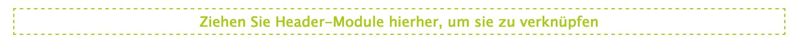
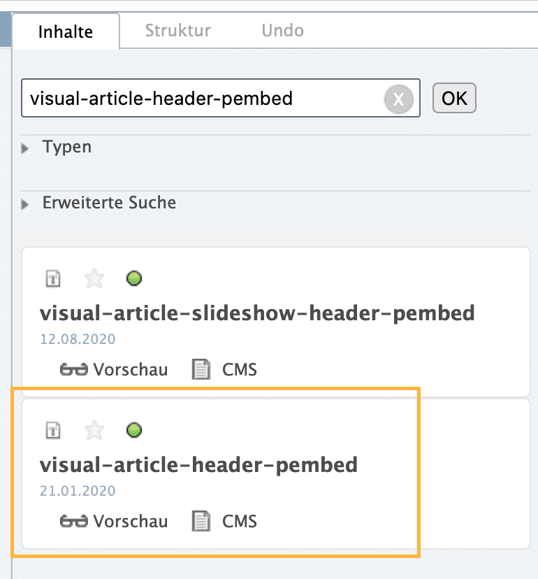
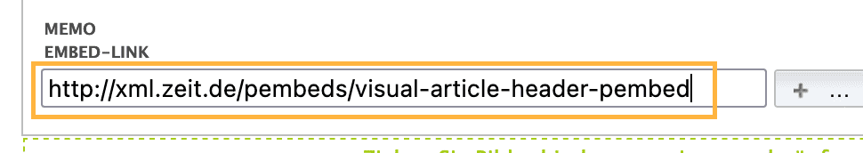

# Der Visual Article

### Die Entstehungsgeschichte

Vor Jahren hat Julian Stahnke eigenmächtig das [visual-article-header-pembed](https://vivi.zeit.de/repository/pembeds/visual-article-header-pembed/@@view.html) gebaut, das es erlaubt hat, Grafiken in voller Breite darzustellen – wahlweise noch vor dem Titel. Nachdem die Entwicklungs-Redaktion lange Widerstand leistete, hat sie es dann aber auf vielseitigen Wunsch in Vivi übernommen.

Das oben verlinkte Pembed müssen wir aber weiterhin jeweils ins Header Modul ziehen. Aber alles der Reihe nach.

### Ablauf

⚠️ **Achtung**: Grundsätzlich erledigt dies in 99% der Fälle Julius Tröger. Dieses Dokument dient eher als Nachschlagewerk für Notfälle.

⚠️ **Außerdem**: Visual Articles dürfen **nur wir** anlegen. Und das Producing. Wenn wir also von anderen gebeten werden, einen Visual Article anzulegen, sagen wir immer nein und leiten sie an das Producing weiter.

#### 1. Optionen

Check einen bestehenden Artikel aus oder erstelle einen Neuen. Im Hauptfenster wirst du das Accordion mit den graubraunen Balken (Status, Metadatan, Optionen, etc.) sehen.

Klappe den Reiter **Optionen** aus und wähle beim Dropdown **Vorlage** die Option **Visual Article**.

Im Dropdown **Seitenkopf** direkt daneben gibt es nun 4 Seitenköpfe zur Auswahl:

- **Header-Modul oben**\
  Das machen wir eigentlich immer ([Link zu Beispiel](https://www.zeit.de/wissen/2022-12/schneefall-klimawandel-deutschland-deutscher-wetterdienst))
- **Vollbreit Split**\
  Benutzen wir kaum. Das ist dann so ein großes Bild in der linken Bildhälfte auf Desktop ([Link zu Beispiel](https://www.zeit.de/gesellschaft/2023-01/ueberfluss-krise-inflation-energiekrise-luxus-hamburg-rahlstedt))
- **Vollbreit, Text unter Bild**\
  Bietet Platz für nur ein flaches Hauptbild
- **Vollbreit, Text auf Bild**\
  Allseits beliebt ([Link zu Beispiel](https://www.zeit.de/gesellschaft/2023-01/migration-minderheiten-niederlande-maurice-crul-interview))

Wir nutzen wie beschrieben meist die erste Option, um unsere Interaktiven Elemente auf Vollbreit darzustellen.

#### 2. Header-Module

Unten unter dem Accordion-Reiter **Artikel** erscheint nun zwischen Teaser und Artikeltext eine Drag-and-Drop-Fläche:

Hier kann man theoretisch interaktive Elemente reinziehen, die dann sogar **über dem Titel** erscheinen. Das machen wir aber tendenziell nicht mehr.

In der Rechten Spalte wechseln wir in den Reiter **Struktur** und darin dann in den Unterreiter **Header**. Dort ziehen wir nun das Element **Embed-Link** in die Fläche links im Hauptfenster "Ziehen Sie Header-Module hierher, um sie zu verknüpfen.

In dieses Feld ziehen wir nun das **visual-article-header-pembed**. Wir finden es rechts über die Suche (im Reiter **Inhalt**):

Wir ziehen es per Drag & Drop in das leere Textfeld des Embed-Links im Header-Bereich:

Anschließend klicken wir in neben das Textfeld und warten, bis die zusätzlichen Menu-Elemente erscheinen.

Im Dropdown **Layout** wählen wir die Option **ZON ohne Bild**. Dann haben wir, was wir wollten: Einen leeren Artikel, in den wir in den Header unsere Pembeds reinziehen können.

#### 3. Artikeltext

Nun ziehen wir unser interaktives Element meist an den Anfang des Artikeltexts. Diesen Schritt solltest du bereits kennen. Du suchst unter **Inhalt** nach dem Namen deines Pembeds und ziehst es an die gewünschte Stelle.

#### 4. Byline

Standardmässig erscheinen Autor:innen, die wir zum Artikel hinzufügen, zwischen Lead und Artikeltext. Statt einer langen Byline möchten wir (vor allem auf Mobil) aber lieber **direkt mit unserem erstem interaktiven Element einsteigen**.
Mit dem Vivi Embed [byline-verschieben](https://vivi.zeit.de/repository/administratives/embeds/byline-verschieben/@@view.html) kannst du die Byline an einen beliebigen Ort im Artikel verschieben. Über einen Parameter können zwei verschiedene Styles ausgewählt werden.

#### 5. Werbung

Nun müssen wir noch Werbeplätze in unserem Artikel festlegen. Der Visual Article hat von Haus aus keine Werbung drin.

Mehr dazu auf der Unterseite [Werbung](?path=/docs/wissen-werbung--docs).

PS: Früher gab's auch noch Stücke, die fast ganz ohne Vivi auskamen ([zum Beispiel dieses](https://www.zeit.de/feature/deutsche-bevoelkerung-stadt-land-unterschiede-vorurteile)). Da war dann aber keine Werbung drin und auch kein Kommentarbereich. Beides ist aber wichtig.
