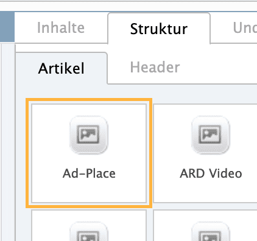

# Werbung

Der Visual Article hat von Haus aus keine Werbung drin. Bei solchen müssen wir das selber machen – Julius macht das in der Regel.

[In diesem Dokument](https://paper.dropbox.com/doc/Frei-platzierbare-Adplaces-in-visual-articles--BwMNhu~vqBIuJOLOZyuOtW1oAg-8QjjSoOyEFWVtHrzyKRXw) ist beschrieben, nach welchen Regeln wir das machen. Die Kurzfassung:

##### a) Zwischen interaktivem Element und Byline

Eine Werbung, die immer platziert werden muss, ist die sogenannte **IQD**. Um sie zu platzieren gehen wir rechts wieder auf den Reiter **Struktur** und nehmen dort das erste Element: **Ad-Place**:

Dieses ziehen wir direkt unter das erste interaktive Element. Im Dropdown **Tile**, das dieses Modul beinhaltet, wählen wir die Option **Desktop: 3 und Mobil: 1** aus. Nicht hübsch, aber muss sein.

##### b) Nach dem 2. oder 3. Absatz

Der zweite Werbeblock muss nach dem 2. oder 3. Absatz rein. Da ziehen wir zwei Mal das **Ad-Place** Element hin und zwar in der Ausführung **Mobil 3** und **Desktop 8**. Auf Desktop ist das eine Werbung, die rechts neben dem Text steht. Da diese relativ hoch sein kann, lassen wir wenn es nicht anders geht Desktop 8 weg.

##### c) Weiter unten

Als zweitletzten Werbeplatz nehmen wir **Mobile 4** und **Desktop 4**. Der Ort ist dieses Mal sekundär, am besten also weit weg von unseren interaktiven Elementen.

##### d) Eigenwerbung

Fast ganz am Ende machen wir dann nochmal einen Werbe-Platz **Content Marketing Teaser Mobil**. Das sind Zeit-interne Kampagnen (z.B. Z2X oder so).

##### e) Hintergrundwerbung

Es gibt Werbung, die den Hintergrund ganz auffüllt mit Bildern. Das dürfen wir deaktiveren, weil sie unsere Grafiken ziemlich verunmöglichen würden.

Hierfür benötigt man allerdings Sonderrechte in Vivi. Man klickt dafür nämlich über der mittleren Spalte auf den Reiter **Admin** und deaktiviert dort den Haken **Außenwerbung anzeigen**.

Dafür also am besten jemanden fragen, der diese Sonderrechte besitzt.
